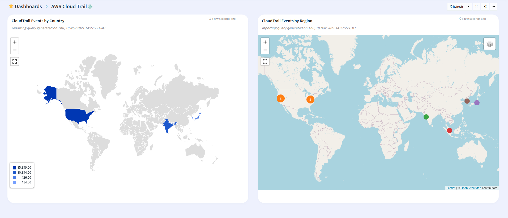

# Logiq cluster monitoring

## Features
* Monitor AWS CloudTrail events

## Configuration

* Edit aws-cloudtrail.json and edit the "datasources" section with your prometheus endpoint
* Edit the name of the dashboard, defaults to AWS CloudTrail

## Steps to import

* Download aws-cloudtrail.json
* Run logiqctl to import the dashboard

```
logiqctl create dashboard -f aws-cloudtrail.json
```

## Screenshot

