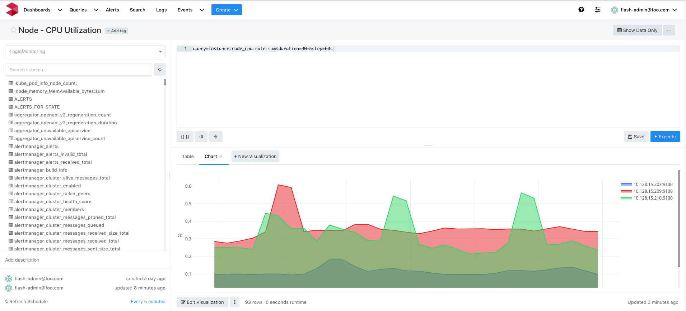

# K8S Cluster monitor

## Features
* Monitors node level metrics for the K8S cluster

## Configuration

* None required 

## Steps to import

* Download cluster.json
* Run logiqctl to import the dashboard json

```
logiqctl create dashboard -f cluster.json
```

## Screenshot


