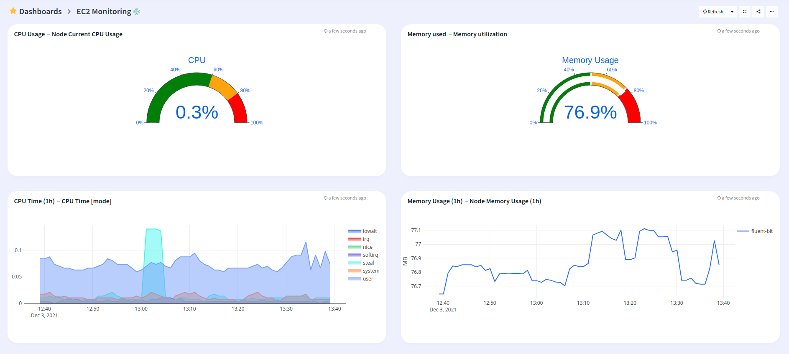
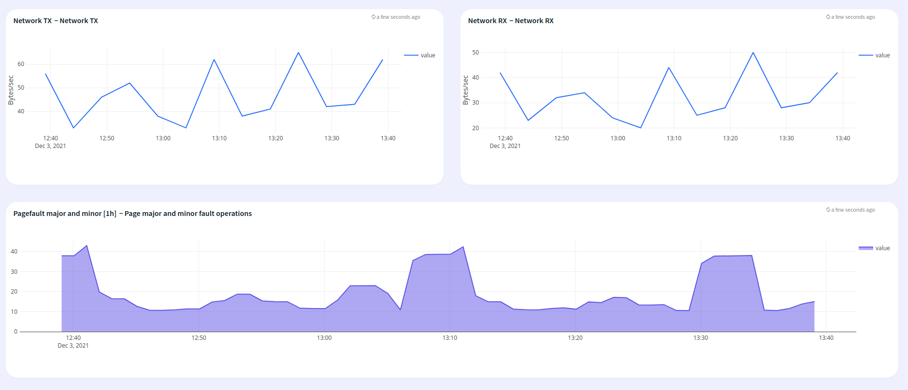

# Logiq cluster monitoring

## Features
* Monitor Amazon EC2 instances

## Configuration

* Edit ec2-monitoring.json and edit the "datasources" section with your prometheus endpoint
* Edit the name of the dashboard, defaults to EC2 Monitoring

## Steps to import

* Download ec2-monitoring.json
* Run apicactl to import the dashboard

```
logiqctl create dashboard -f ec2-monitoring.json
```

## Screenshot

