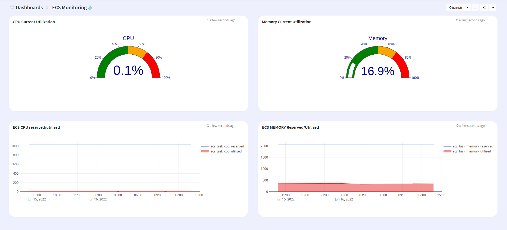

# Logiq cluster monitoring

## Features
* Monitor AWS ECS instance

## Configuration

* Edit elastic.json and edit the "datasources" section with your prometheus endpoint
* Edit the name of the dashboard, defaults to ECS Monitoring

## Steps to import

* Download ecs-monitoring.json
* Run logiqctl to import the dashboard

```
logiqctl create dashboard -f ecs-monitoring.json
```

## Screenshot


