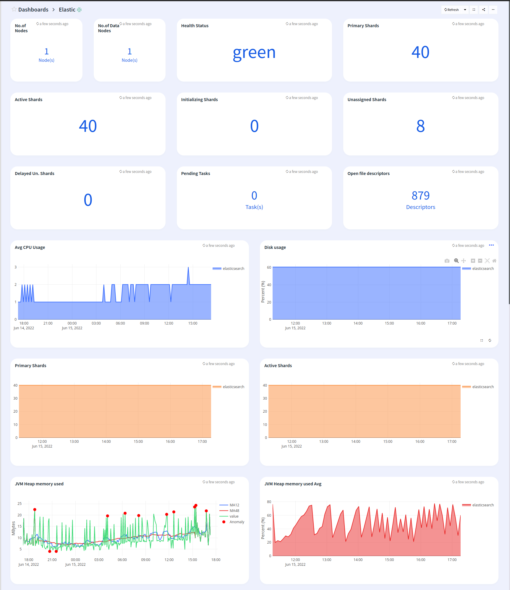
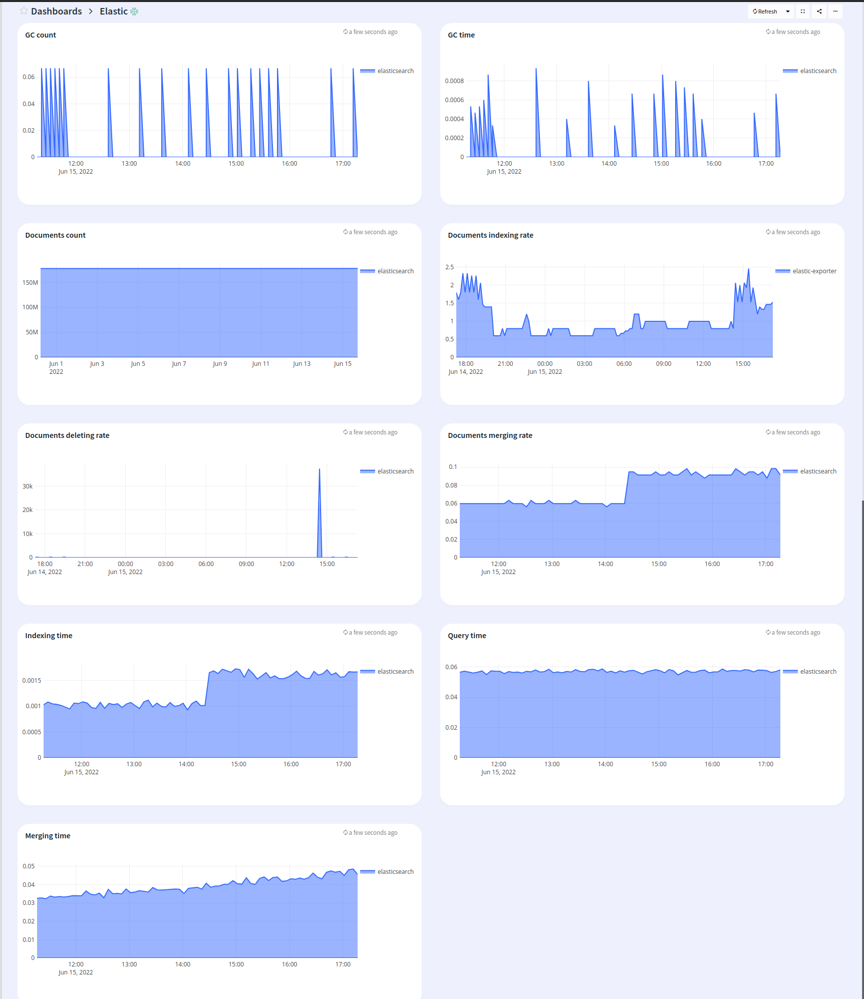

# Apica Ascent cluster monitoring

## Features
* Monitor Elastic instance

## Configuration

* Edit elastic.json and edit the "datasources" section with your prometheus endpoint
* Edit the name of the dashboard, defaults to Elastic

## Steps to import

* Download elastic.json
* Run apicactl to import the dashboard

```
logiqctl create dashboard -f elastic.json
```

## Screenshot


