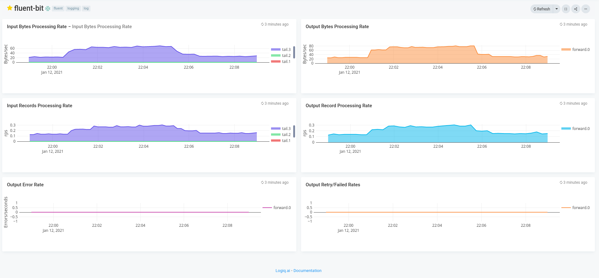

# Apica Ascent cluster monitoring

## Features
* Monitor the deployed fluentbit cluster

## Configuration

* Edit fluentbit.json and edit the *"datasources"* section with your prometheus endpoint
* Edit the name of the dashboard, defaults to fluent-bit

## Steps to import

* Download fluentbit.json
* Run apicactl to import the dashboard json

```
logiqctl create dashboard -f fluentbit.json
```

## Screenshot
