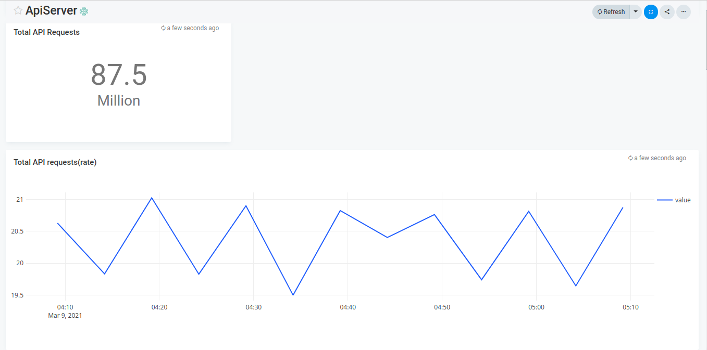
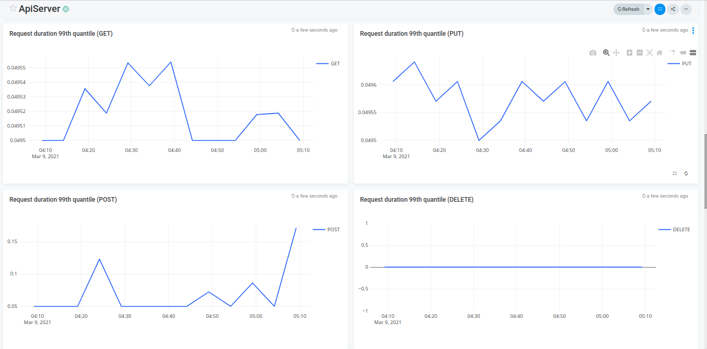
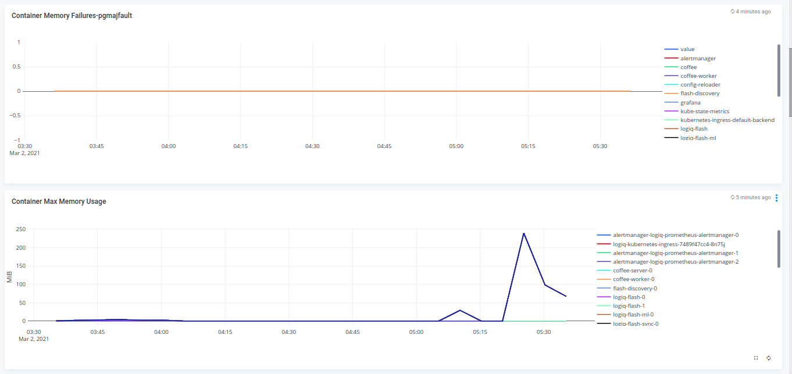
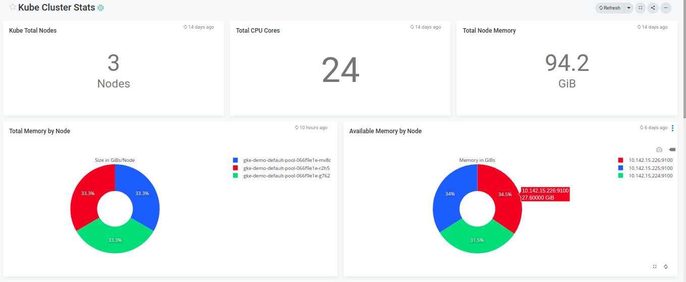
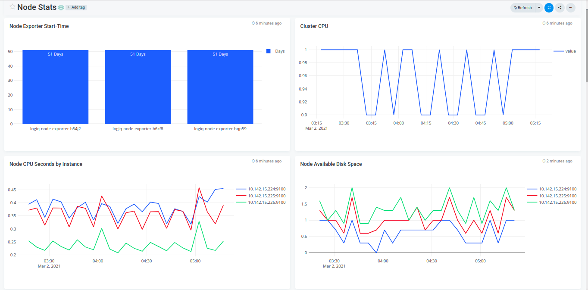

# Kubernetes Level monitoring

## Features
* Monitor Container, ApiServer, Kube Pods, Node level statistics via LOGIQ prometheus connector

## Configuration

* Edit filename.json and edit the *"datasources"* section with your prometheus endpoint
* Edit the namespaces you want to monitor - defaults to container-stats

## Steps to import

* Download filename.json
* Run logiqctl to import the dashboard json

```
logiqctl create dashboard -f apiserver.json
logiqctl create dashboard -f cluster.json
logiqctl create dashboard -f container.json
logiqctl create dashboard -f kube-cluster.json
logiqctl create dashboard -f node.json
```


## Screenshot

* All the screenshots are arranged in following manner

```
apiserver-0.png
apiserver-1.png
cluster-0.png
cluster-1.png
container-0.png
container-1.png
kube-cluster.png
node.png
```










