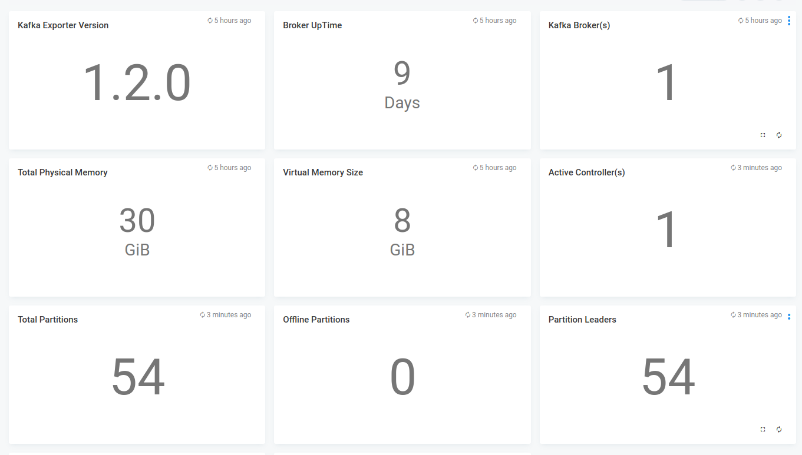
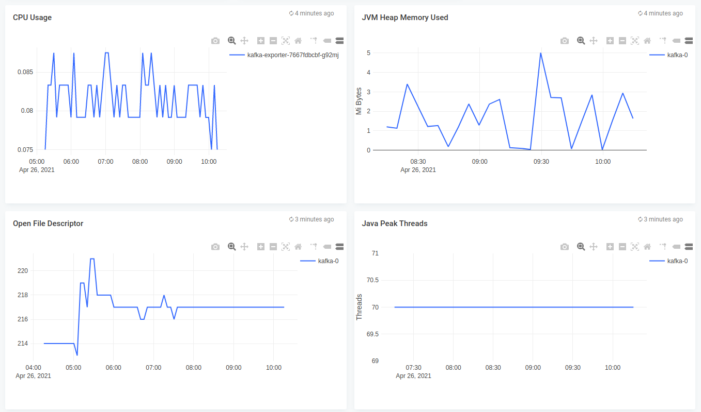
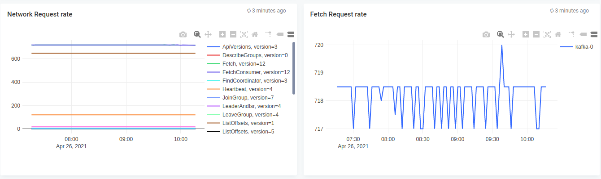

# Kafka monitoring

## Features
* Monitor kafka

## Configuration

* Edit kafka.json and edit the *"datasources"* section with your prometheus endpoint
* Edit the name of the dashboard, defaults to kafka

## Steps to import

* Download kafka.json
* Run apicactl to import the kafka.json

```
logiqctl create dashboard -f kafka.json

```

## Screenshot



