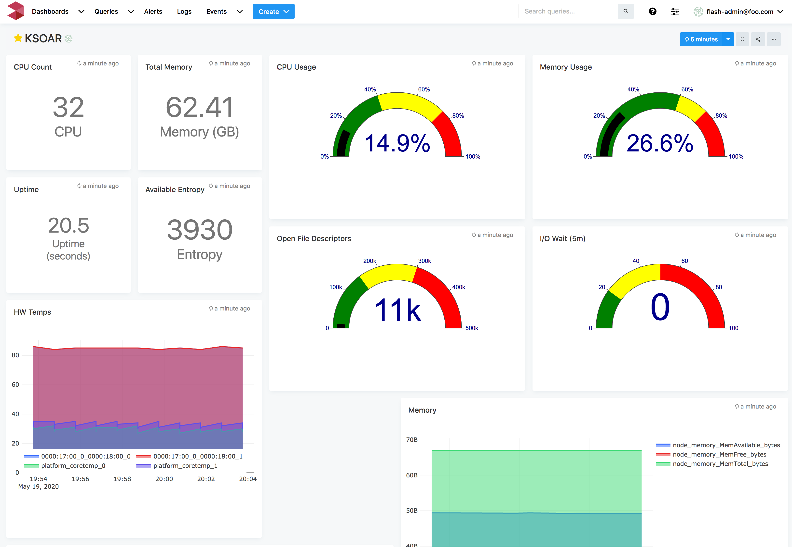
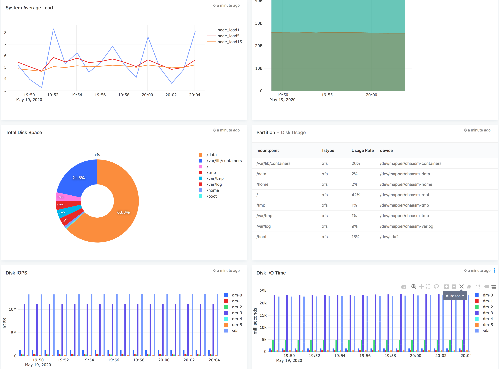
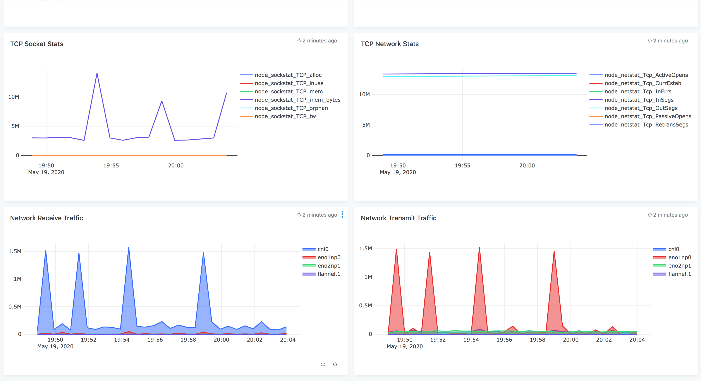
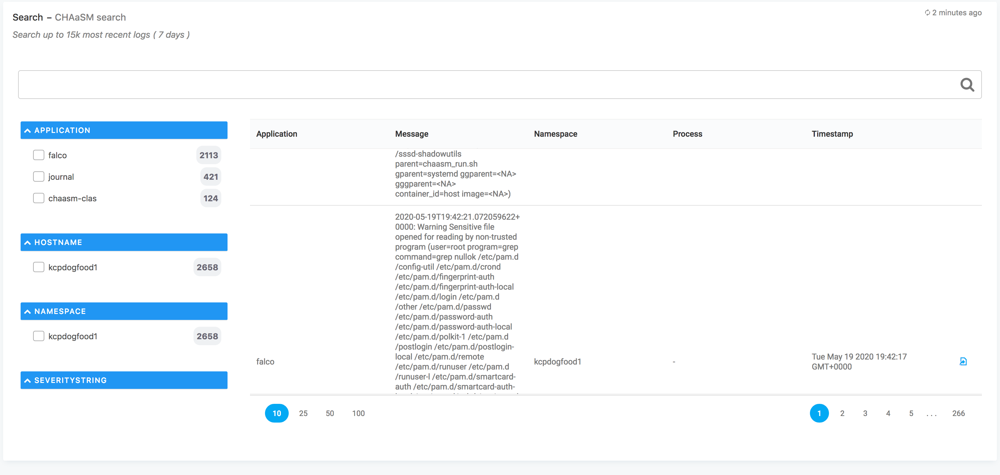

#KSOAR kubernetes control plane monitoring

## Features
* Dashboard to monitor the K8S control plane from KSOAR.ai
* Node exporter monitoring via prometheus connector
* ChaaSM AI, Falco integration 

## Configuration

* Edit ksoar.json and edit the *"datasources"* section with your prometheus endpoint

## Steps to import

* Download ksoar.json
* Run logiqctl to import the dashboard json

  $logiqctl create dashboard -f ksoar.json

## Screenshot

