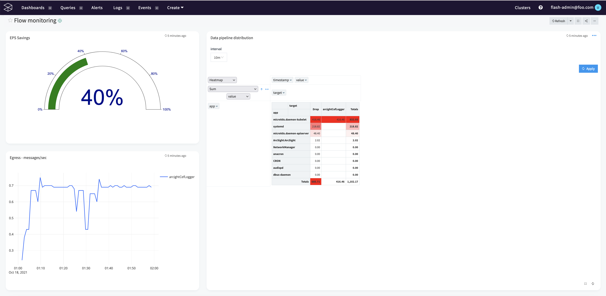
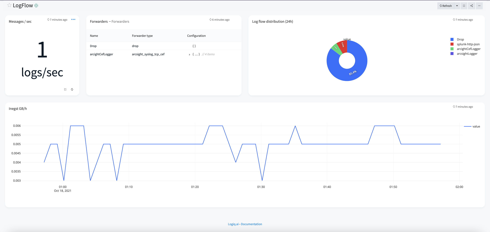

# Logflow basic dashboards for data pipeline monitoring

## Features
* Shows configured data pipeline flows
* Show EPS savings
* Show pipeline usage

## Configuration

* Edit the LogFlow datasource created to have the right host/credentials

## Steps to import

* Download for ex: logflow-1.json
* Run logiqctl to import the file logflow-1.json

```
logiqctl create dashboard -f logflow-1.json
logiqctl create dashboard -f logflow-2.json

```

## Screenshot



