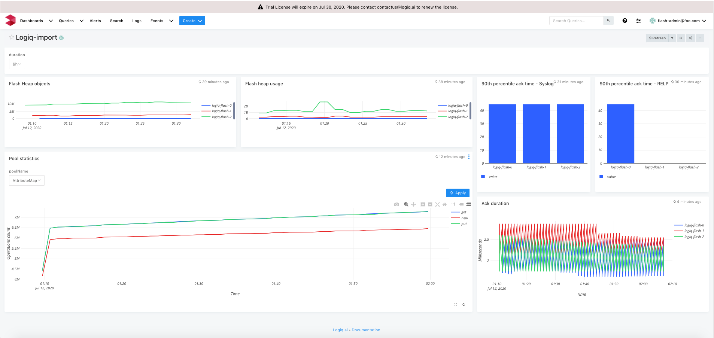

# Logiq cluster monitoring

## Features
* Monitor the deployed logiq cluster

## Configuration

* Edit logiq.json and edit the *"datasources"* section with your prometheus endpoint
* Edit the name of the dashboard, defaults to logiq

## Steps to import

* Download logiq.json
* Run logiqctl to import the dashboard json

```
logiqctl create dashboard -f logiq.json
```

## Screenshot

