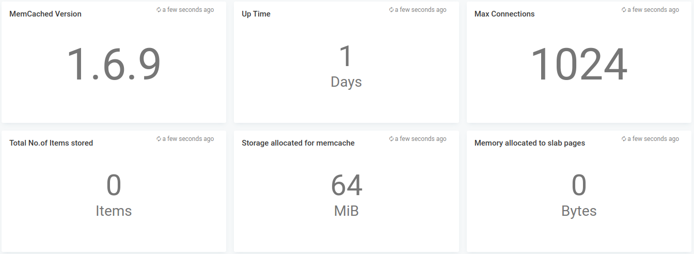
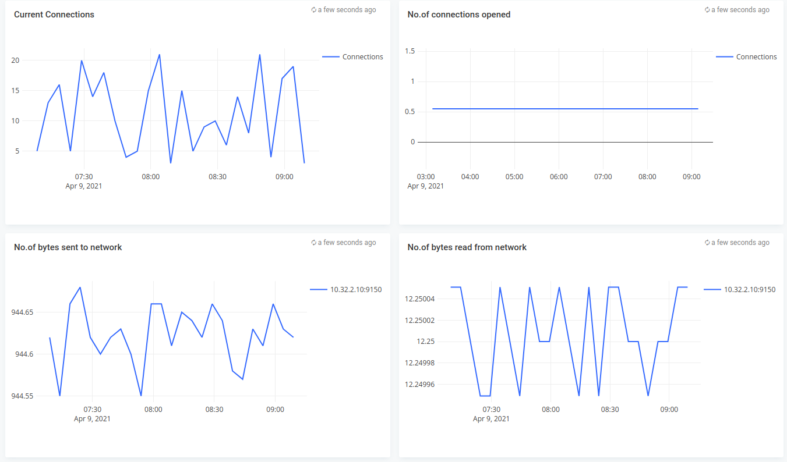

# Memcached Level monitoring

## Features
* Monitor Memcached in-memory data store via LOGIQ prometheus connector

## Configuration

* Edit memcached.json and edit the *"datasources"* section with your prometheus endpoint
* Edit the namespaces you want to monitor - defaults to memcached

## Steps to import

* Download memcached.json
* Run logiqctl to import the dashboard json

```
logiqctl create dashboard -f memcached.json
```

## Screenshot


