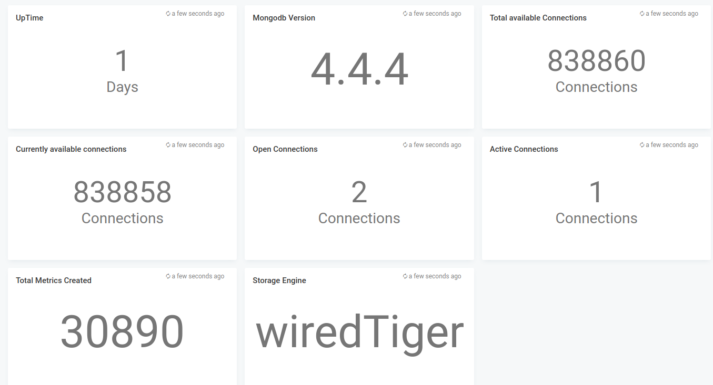
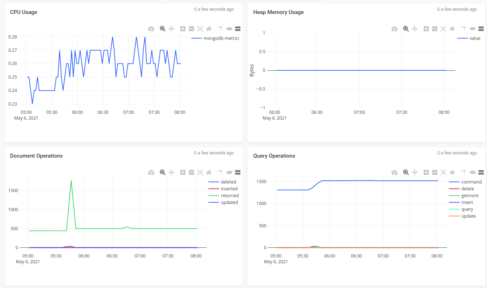
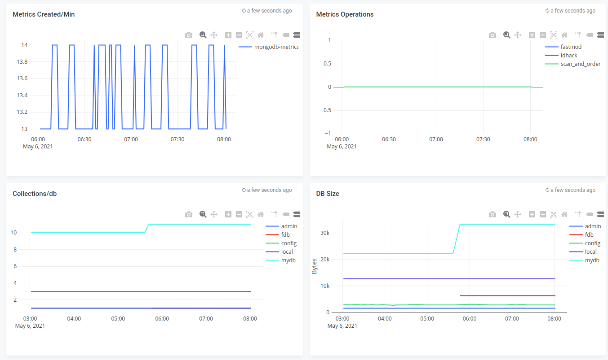

# MongoDB monitoring

## Features
* Monitor mongodb

## Configuration

* Edit mongodb.json and edit the *"datasources"* section with your prometheus endpoint
* Edit the name of the dashboard, defaults to mongodb

## Steps to import

* Download mongodb.json
* Run apicactl to import the mongodb.json

```
logiqctl create dashboard -f mongodb.json
```

## Screenshot



