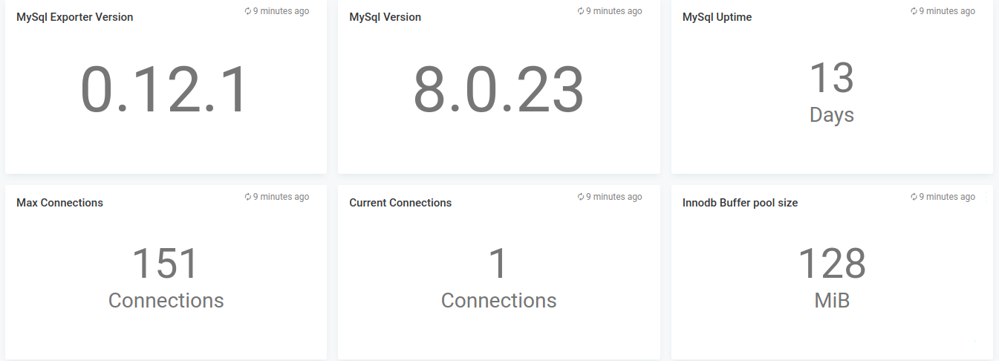
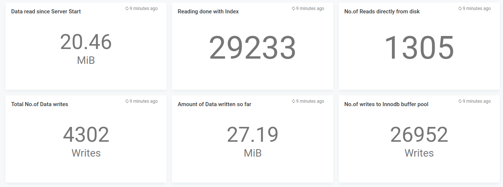
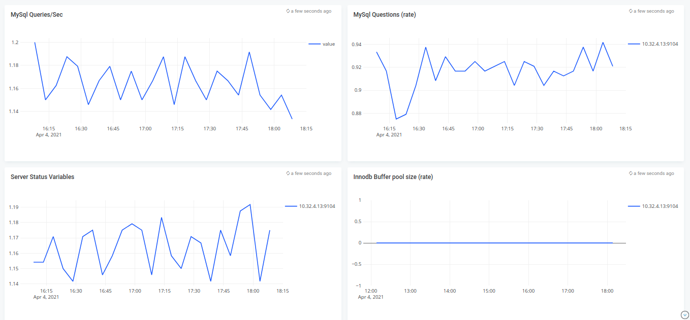

# MySql Level monitoring

## Features
* Monitor MySql level statistics via Apica Ascent prometheus connector

## Configuration

* Edit mysql-settings.json and edit the *"datasources"* section with your prometheus endpoint
* Edit the namespaces you want to monitor - defaults to mysql-settings

## Steps to import

* Download mysql-settings.json
* Run apicactl to import the dashboard json

```
logiqctl create dashboard -f mysql-settings.json
logiqctl create dashboard -f mysql-database.json
```

## Screenshot




