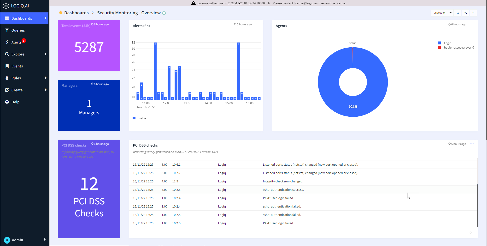
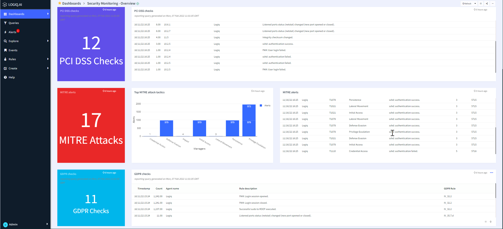
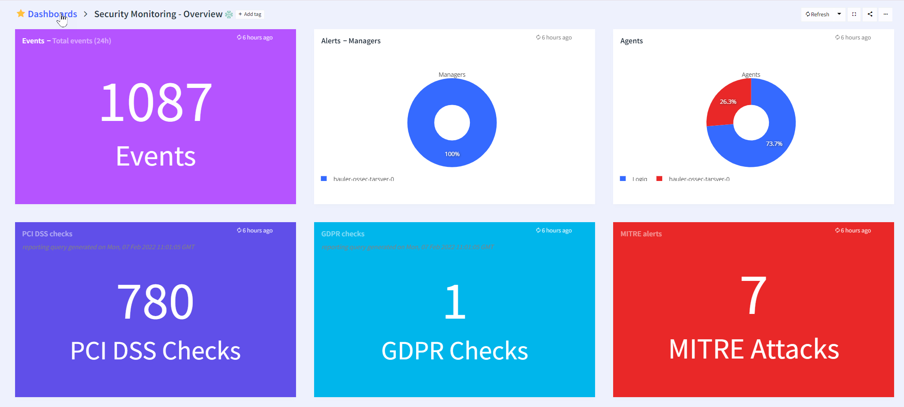
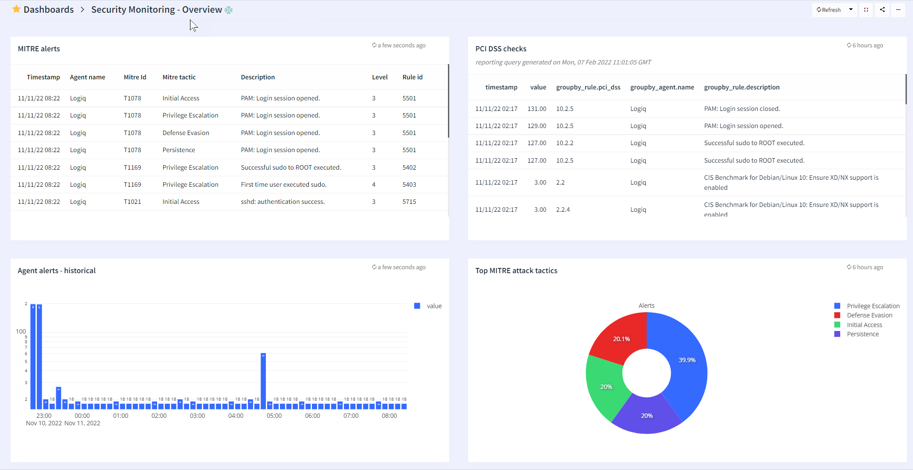

# Apica Ascent Level monitoring

## Features
* Monitor overview of OSSEC infrastructure security monitor overview
* It currently uses logs ingested via open source wazuh agent: https://documentation.wazuh.com/current/installation-guide/wazuh-agent/index.html
* See docs.logiq.ai for more info (TBD)

## Configuration

* Edit filename.json and edit the *"datasources"* section with your prometheus endpoint.  In the provided Json file, the end point is "http://prometheus-operated:9090" 
* Edit the namespace you want to monitor.  In the provided Json example file, namespace "hauler-secmon-dc1" needs to be manually updated.
* Edit the application you want to monitor.  In the provided Json example file, application "ossec" needs to be manually updated.
* Edit the namespace:app_name pair.  In the provided Json example file, namespace:application pair "hauler-secmon-dc1:ossec" needs to be manually updated.

## Steps to import

* Download the example dashboard ossec-security-monitor-overview.json
* Run apicactl to import the dashboard ossec-security-monitor-overview.json

```
logiqctl create dashboard -f ossec-security-monitor-overview.json

```

## Screenshot





