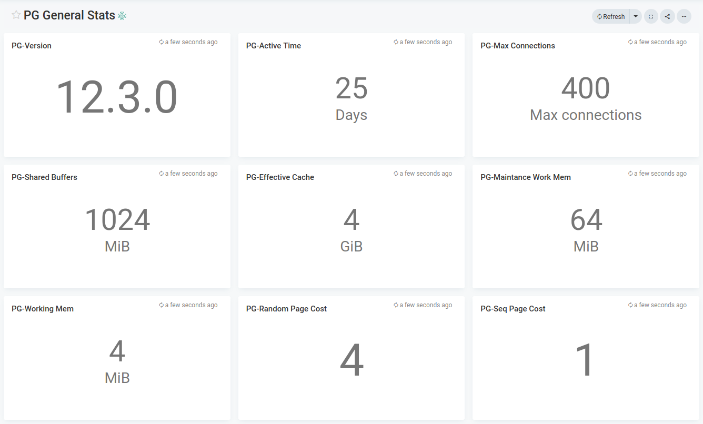
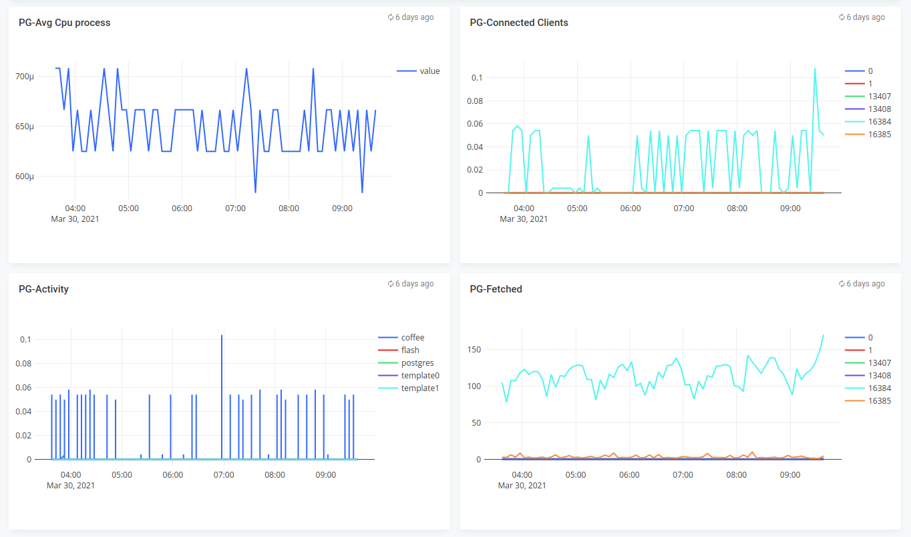
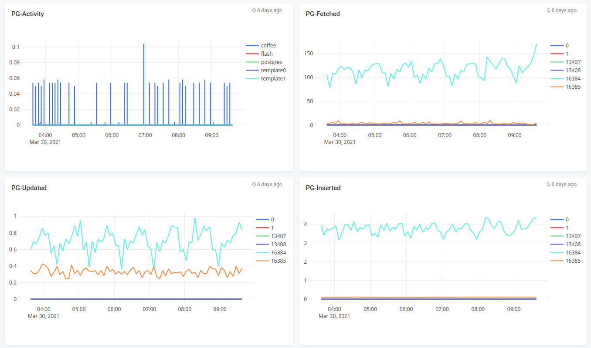

# Postgres monitoring

## Features
* Monitor postgres

## Configuration

* Edit postgres.json and edit the *"datasources"* section with your prometheus endpoint
* Edit the name of the dashboard, defaults to Postgres

## Steps to import

* Download postgres.json
* Run apicactl to import the dashboard json

```
logiqctl create dashboard -f postgres.json
logiqctl create dashboard -f postgress-general-stats.json
logiqctl create dashboard -f postgress-database-stats.json
```

## Screenshot



