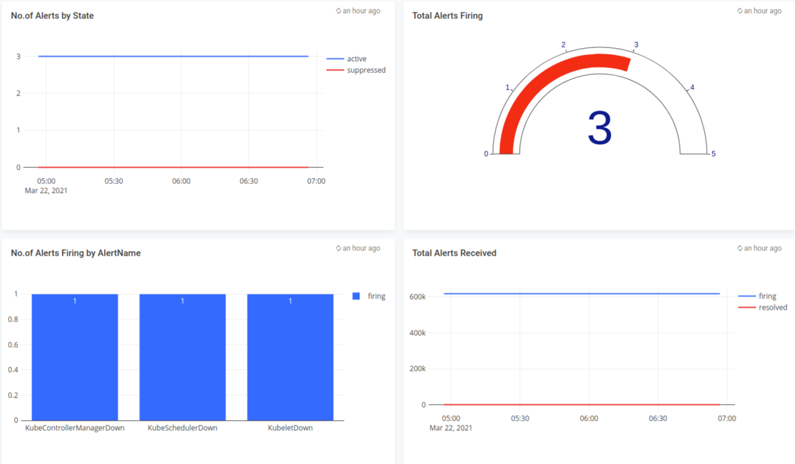
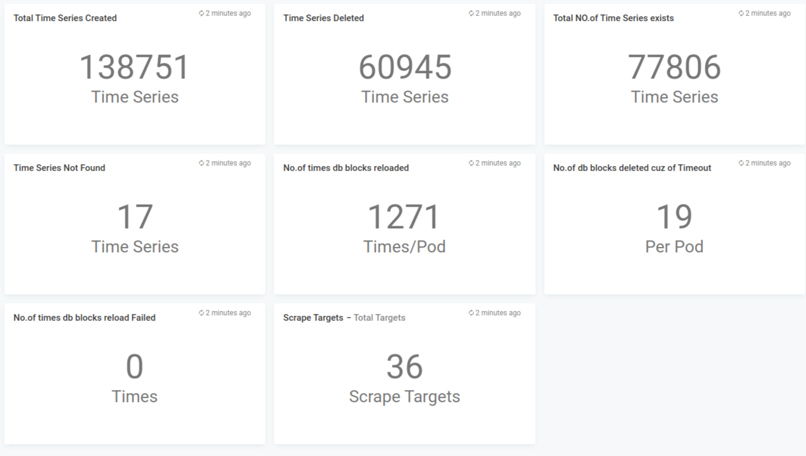
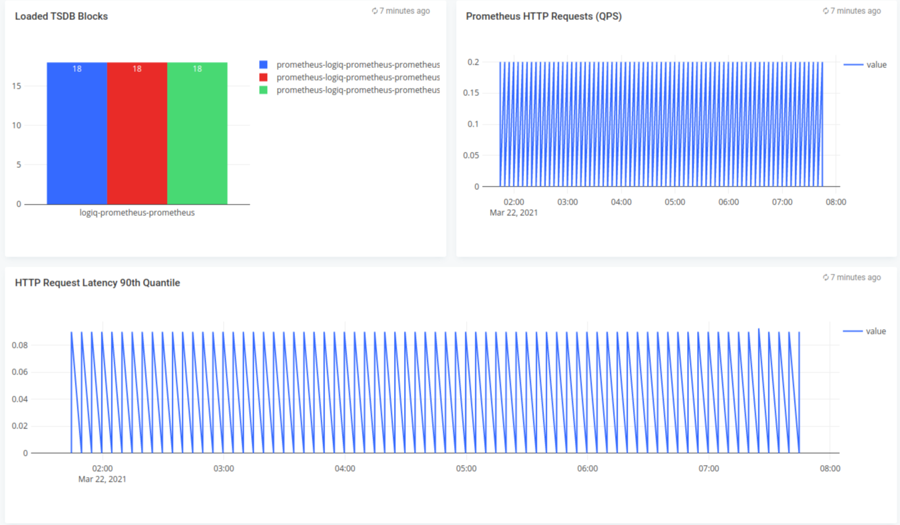

# Prometheus Level monitoring

## Features
* Monitor Prometheus, AlertManager via Apica Ascent Prometheus connector

## Configuration

* Edit for ex: alert-manager.json and edit the *"datasources"* section with your prometheus endpoint
* Edit the namespaces you want to monitor - defaults to alert-manager

## Steps to import

* Download for ex: alert-manager.json
* Run apicactl to import the alert-manager.json

```
logiqctl create dashboard -f alert-manager.json
logiqctl create dashboard -f prometheus-static.json
logiqctl create dashboard -f prometheus.json

```


## Screenshot









