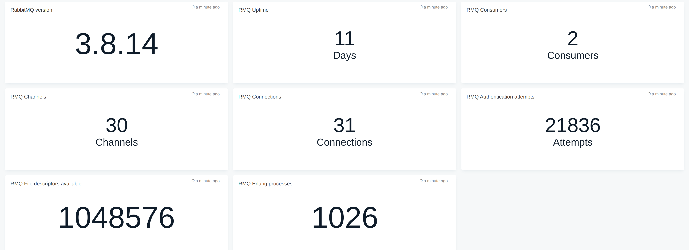
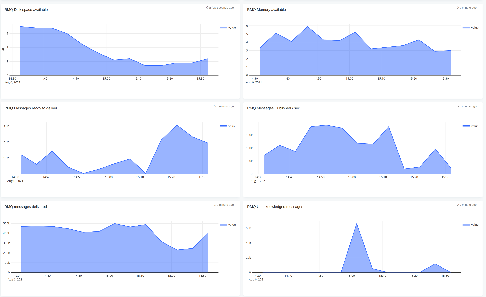

# RabbitMQ monitoring

## Features
* Monitor RabbitMQ via LOGIQ prometheus connector

## Configuration

* Edit for ex: rabbitmq.json and edit the *"datasources"* section with your prometheus endpoint
* Edit the namespaces you want to monitor - defaults to rabbitmq

## Steps to import

* Download for ex: rabbitmq.json
* Run logiqctl to import the rabbitmq.json

```
logiqctl create dashboard -f rabbitmq.json

```

## Screenshot




