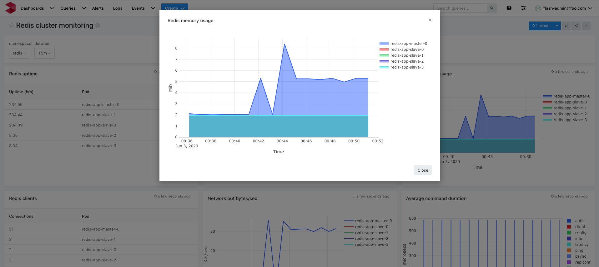
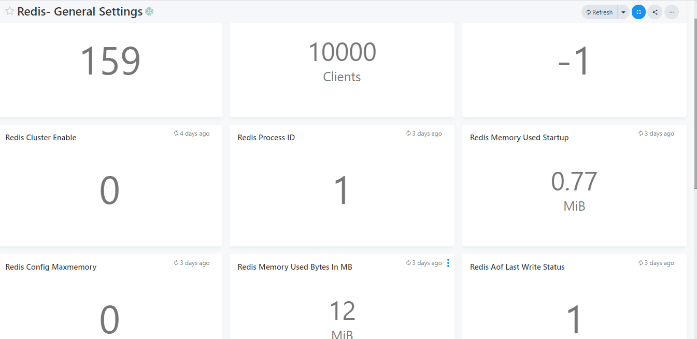
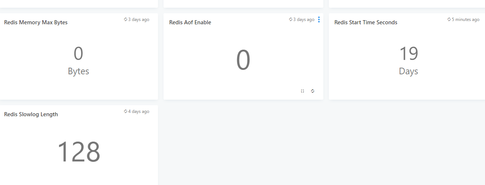
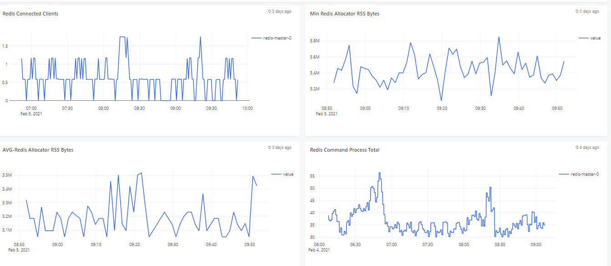

# Redis cluster monitoring

## Features
* Monitor one or more redis clusters via Apica Ascent prometheus connector
* Dropdown selector to switch redis running on different namespaces

## Configuration

* Edit redis-cluster-monitoring.json and edit the *"datasources"* section with your prometheus endpoint
* Edit the namespaces you want to monitor - defaults to redis and redis-2

## Steps to import

* Download redis-cluster-monitoring.json
* Run apicactl to import the dashboard json

```
logiqctl create dashboard -f redis-cluster-monitoring.json
logiqctl create dashboard -f redis-cluster-monitoring-1.json
logiqctl create dashboard -f redis-database-monitoring.json
```

## Screenshot






