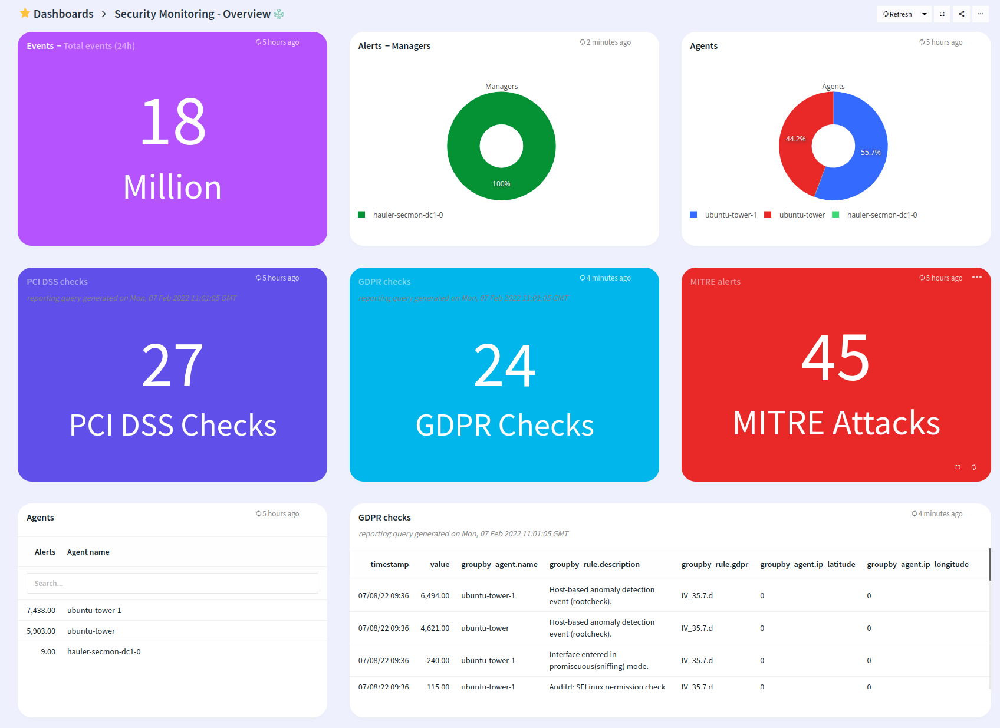

# Security monitoring with the help of OOSEC

## Features
* Monitor Security events via LOGIQ Prometheus connector

## Configuration

* Edit security-monitoring-overview.json and edit the *"datasources"* section with your prometheus endpoint

## Steps to import

* Download the file security-monitoring-overview.json
* Run logiqctl to import the security-monitoring-overview.json

```
logiqctl create dashboard -f security-monitoring-overview.json

```

## Screenshot




