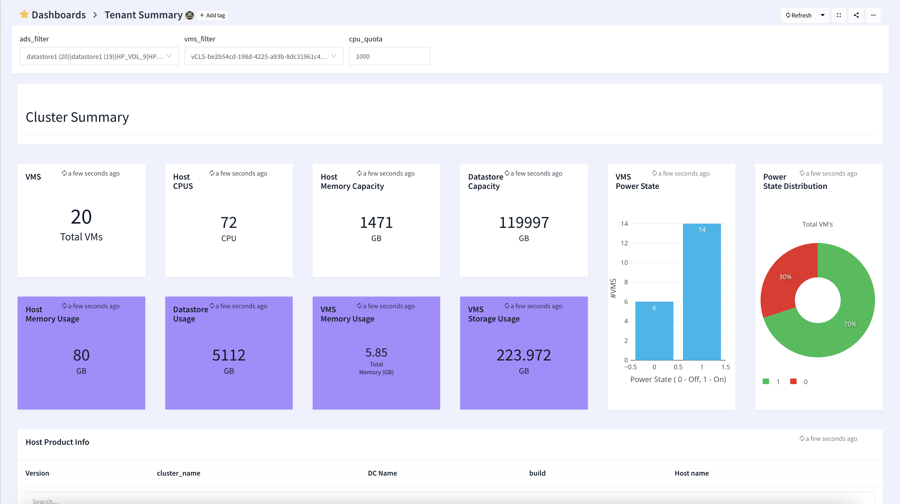
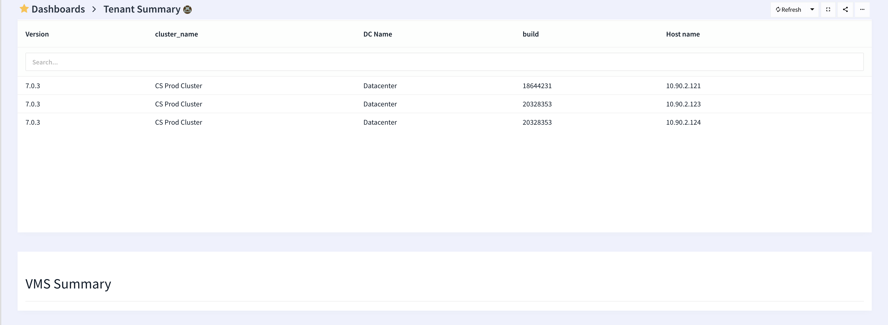
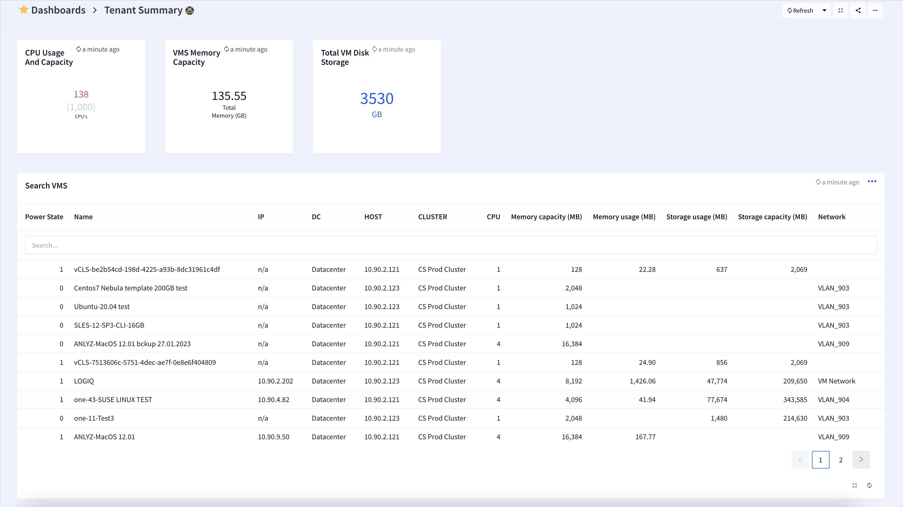
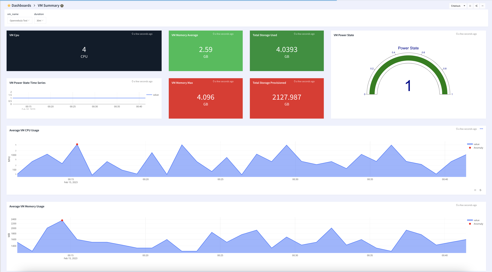

# VCenter monitoring

## Vmware node exporter for prometheus
* Uses vmware_exporter via prometheus - https://github.com/logiqai/vmware_exporter.git

## Features
* Monitor VCenter

## Configuration

* Edit cluster-summary.json and edit the *"datasources"* section with your prometheus endpoint
* Edit vm-summary.json and edit the *"datasources"* section with your prometheus endpoint
* Edit the name of the dashboards

## Steps to import

* Download cluster-summary.json
* Download vm-summary.json
* Run apicactl to import the cluster and vm summary json's

```
logiqctl create dashboard -f cluster-summary.json
logiqctl create dashboard -f vm-summary.json

```

## Screenshot

---

---

---

