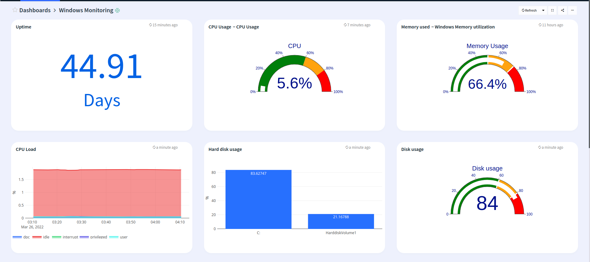
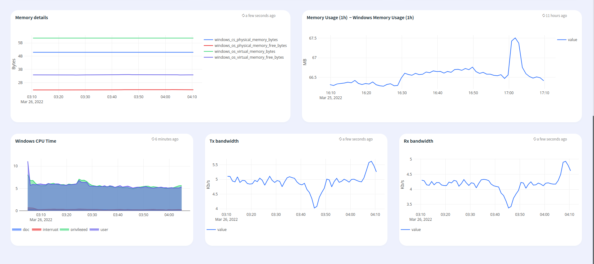

# Windows System monitoring

## Features
* Monitor Windows System events via Apica Ascent Prometheus connector

## Configuration

* Edit windows-exporter.json and edit the *"datasources"* section with your windows-exporter endpoint

## Steps to import

* Download the file windows-monitoring.json
* Run logiqctl to import the windows-monitoring.json

```
logiqctl create dashboard -f windows-monitoring.json
```

## Screenshot




